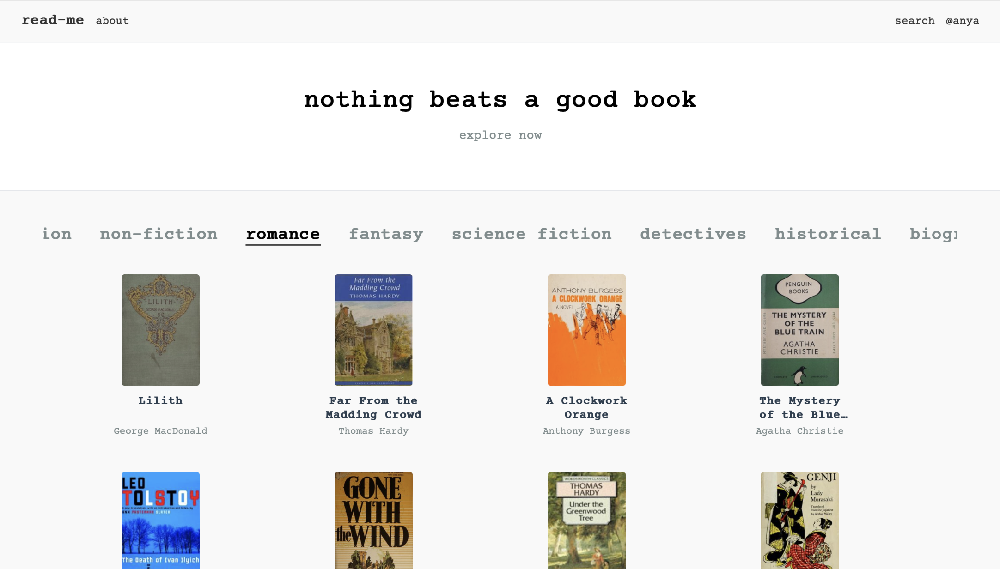

# read-me

**read-me** is a personal book tracker and reading journal for passionate readers. track what you read, explore new books, set your own categories, and keep a personal archive of your thoughts and ratings. the design of read-me is clean, readable, and calm, inspired by personal journals and reading diaries. everything (from backend to interface) is custom-built with modern web technologies and practicies.

---

## features

- **user authentication** with JWT + password hashing
- **persistent backend** (PostgreSQL + Prisma)
- **book search via Open Library API** - fetch title, author, cover, description, and genre
- **personal library** - save books you love or want to read with rating, notes, and status (to-read, reading, finished)
- **favorites** - highlight your favorite books
- **categorized views** for personalized sorting (favourites, reading status, genres etc)
- **backend tests** (jest + supertest)
- **responsive UI** with React 19 + Tailwind
- **custom components** (e.g. `BookCard`, `BookControls`, `BookList`)

---

## tech stack

### backend

- Node.js + Express (REST API)
- PostgreSQL + Prisma ORM
- JWT authentication
- password hashing with bcrypt
- node-fetch to interact with Open Library API
- jest + supertest for backend testing

### frontend

- React 19 + Vite
- Tailwind CSS
- React Router

---

## next steps

- reading progress tracking (pages/days)
- responsive calendar-based reading log
- caching for Open Library responses
- personalized recommendations based on user preferences

---

## what i learned

- structuring a fullstack application from scratch
- designing user flows and clean UI
- using third-party APIs and displaying dynamic content
- writing and testing backend logic

## personal note

i love reading. i read every day, and I often write notes about what i read. but i never found a book tracking app that actually fit me - they were always either too complex or too limited. so I built my own!

---

i am currently building out my portfolio — learning fast, building fast, and refining my craft every day. if this project speaks to you, feel free to [connect with me](https://github.com/ssendns). i am always open to collaborating on cool, meaningful projects.
