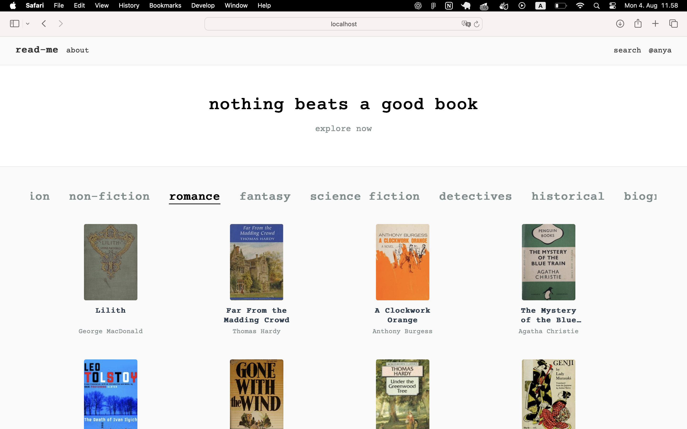

# read-me

**read-me** is a personal book tracker and reading journal for passionate readers.  
it is a minimalistic, thoughtful space where you can create your own library, take notes, rate books, and track your reading journey — without unnecessary clutter. the design of Read-Me is clean, readable, and calm — focused on typography and ease of use. inspired by personal journals and reading diaries, with a touch of softness and emotion



---

## features

- **book discovery** — search and explore books via the Open Library API
- **personal library** — save books you love or want to read
- **reading status** — mark books as _planned_, _reading_, or _finished_
- **ratings** — rate each book you have read
- **private notes** — keep personal reflections on every book
- **favorites** — highlight books that mean the most to you
- **categorized views** — filter your library by reading status or favorites
- **responsive UI** — looks great on desktop and mobile
- **JWT authentication** — secure login and personal user space

---

## tech stack

### frontend

- **React** + **Vite**
- **Tailwind CSS** for styling
- **React Router** for navigation
- **custom components** (e.g. BookCard, BookControls, BookList)

### backend

- **Node.js** + **Express**
- **Prisma ORM** + **PostgreSQL** for database access
- **JWT** for authentication
- **bcrypt** for password hashing
- **REST API** for full CRUD functionality
- **Open Library API** for book data

---

## getting started

clone the repo and run the following:

```bash
# install dependencies
npm install

# start dev server
npm run dev
```

make sure to also run the backend server in a separate terminal:

```bash
cd server
npm install
npx prisma generate
npx prisma migrate dev
npm run dev
```

## feedback

if you have any feedback, ideas, or want to contribute — feel free to open an issue or contact me!
